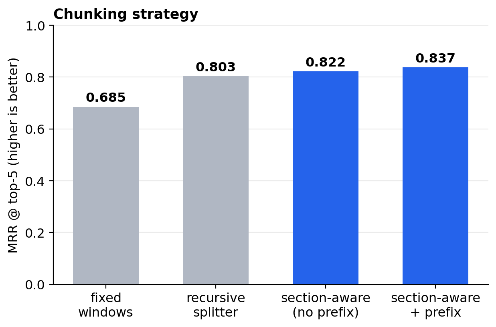
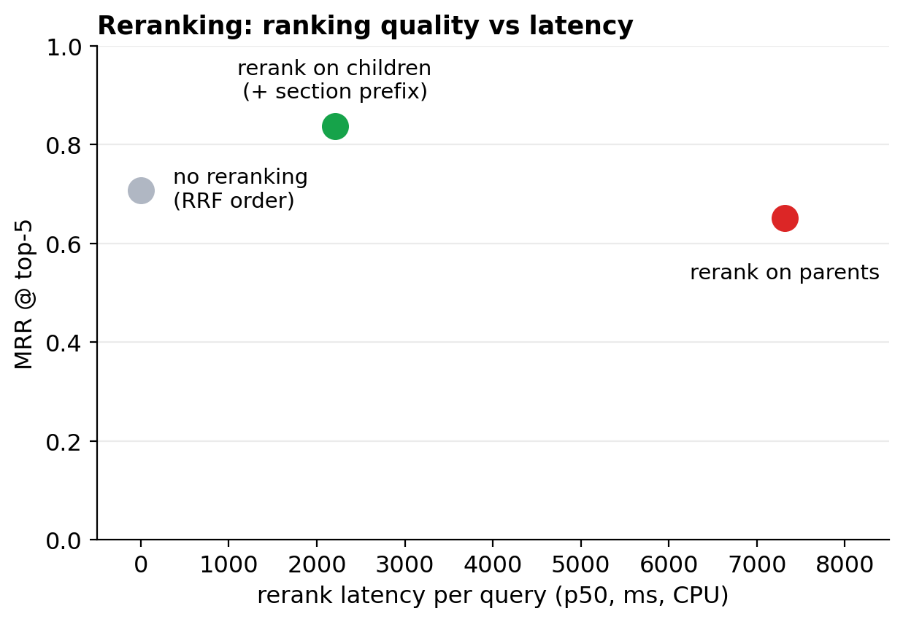
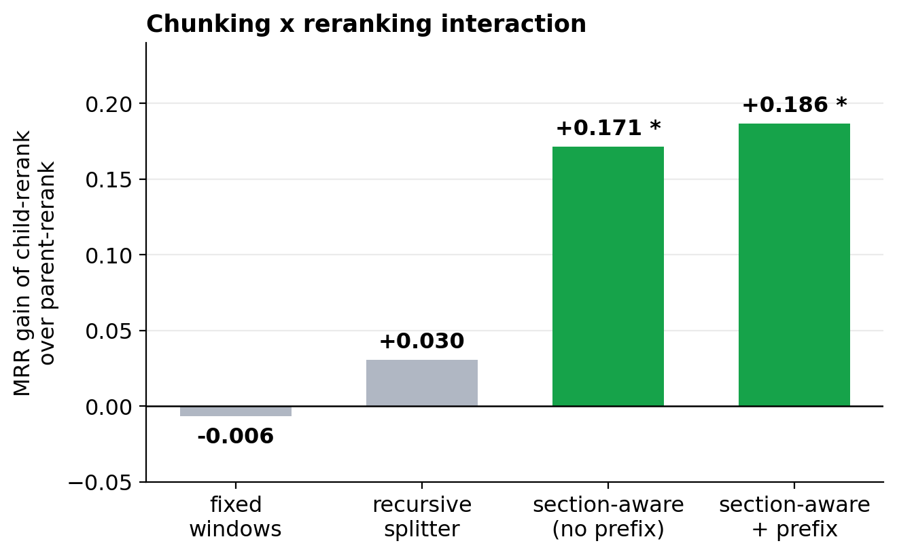
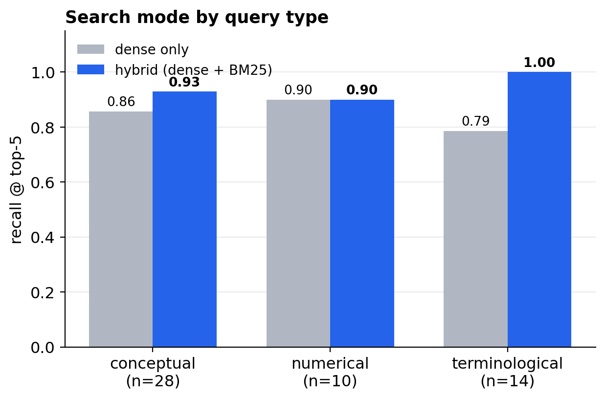
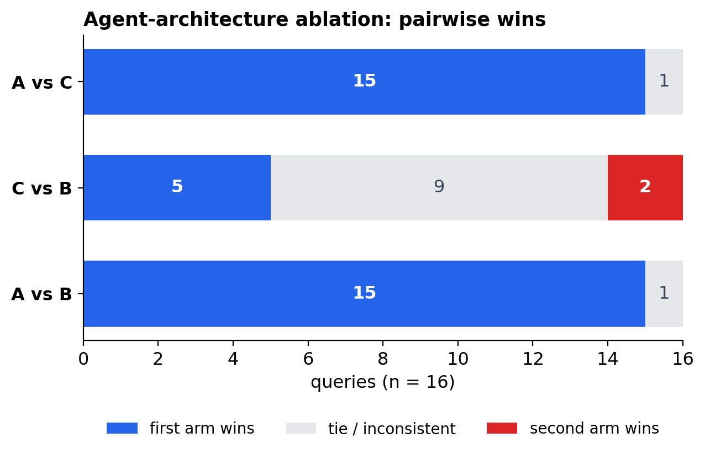

# Econ Policy Agent

**A multi-agent economic policy analysis system where every architectural
decision was measured, not assumed.**

Five specialist LLM agents (Macroeconomist, Labor Economist, Trade Unionist,
Institutional Economist, Fiscal Expert) analyze policy questions in parallel
over a retrieval pipeline built on ~28 institutional reports (BIS, IMF, OECD,
ILO, WTO, World Bank, ECB), then a Critic and a Synthesizer produce a final
assessment. The distinguishing feature of this repo is not the architecture.
It is the **evaluation program around it**: a retrieval evaluation framework
and an LLM-judged architecture ablation that turned every major design choice
into a tested hypothesis.

> **Headline results** (52 evaluation queries, paired statistics):
> retrieval recall@5 = **0.94**, MRR = **0.84** at the chosen operating point;
> hybrid search **+0.10 recall** over dense-only (significant); child-level
> reranking **+0.19 MRR** over parent-level (significant); and the 5-agent
> architecture beats a single agent given identical context **15-0** in
> position-swapped pairwise judging (p < 0.001).

---

## The problem

Economic policy questions ("What would a significant minimum wage increase
mean for employment, inequality, and public finances?") have no single
correct answer; they have *perspectives* that trade off against each other.
A single LLM call tends to produce a smooth, single-voice synthesis that
papers over exactly those tensions. This system makes the tensions explicit:
each specialist retrieves and analyzes from its own angle, a Critic scores
evidence strength, and a Synthesizer integrates the perspectives, surfacing
where the experts agree and where they diverge.

That design costs 6× the LLM calls of a single-agent baseline. **Whether it
is worth it was an open question, so it was measured** (see
[the architecture ablation](#does-the-5-agent-architecture-earn-its-keep)).

## How the system works

If you are new to retrieval-augmented generation (RAG), the core idea in one
paragraph: an LLM cannot hold 28 long reports in its head, so the documents
are cut into small pieces ("chunks"), each piece is converted into a vector
of numbers that captures its meaning ("embedding"), and when a question comes
in, the system finds the pieces whose vectors are closest to the question's
vector, plus, in this system, pieces that share the question's exact words
(classic keyword search, BM25). A second, more careful model ("reranker")
then re-scores the shortlist, and the best pieces are handed to the LLM as
reading material for its answer.

```
                      user question
                          │
        ┌────────┬────────┼────────┬────────┐
        ▼        ▼        ▼        ▼        ▼
   Macro-    Labor    Trade    Institu-  Fiscal        each agent retrieves
   economist economist unionist tional    expert        with its own query angle
        │        │        │        │        │
        ▼        ▼        ▼        ▼        ▼
     analysis analysis analysis analysis analysis      5 parallel LLM analyses
        └────────┴────────┼────────┴────────┘
                          ▼
                       Critic  (scores evidence strength)
                          ▼
                     Synthesizer  →  final assessment with citations
```

The retrieval pipeline, step by step (per agent):

1. **Chunking (two levels).** Documents are cut along their real section
   boundaries. Each section becomes a "parent" chunk (~1,500-3,000
   characters); each parent is further cut into small "child" chunks
   (~400 characters) along paragraph and sentence boundaries. Searching
   happens on the focused children; the LLM reads the fuller parents
   ("small-to-big" retrieval).
2. **Hybrid candidate search.** Two searches run: a semantic one (embedding
   similarity, good at paraphrased questions) and a keyword one (BM25,
   good at rare terms like "r-star" or institution names). Their results
   are merged.
3. **Reranking.** A local cross-encoder model reads each (question, child)
   pair jointly and re-scores the merged pool. This model runs on CPU, free
   and deterministic, with no API involved.
4. **Delivery.** The top 5 *unique parents* (deduplicated after reranking)
   go to the agent, with page numbers and section titles for citations.

Stack: **pymupdf4llm** (PDF → structured markdown) · **LanceDB** (vector
store + built-in keyword index) · **all-MiniLM-L6-v2** (embeddings) ·
**cross-encoder/ms-marco-MiniLM-L-6-v2** (local reranker) · **LangGraph** ·
**Instructor/Pydantic** · **FastAPI / PostgreSQL / Docker** · **Streamlit**.

## Design decisions at a glance: the "why" behind each choice

Every row below was a genuine open question during development. None were
decided by taste; each has a measured answer (details in the Results section
and `eval/report.md`).

| Decision | Alternatives tested | Measured verdict |
|---|---|---|
| **Section-aware chunking**: chunks follow the documents' real section structure | recursive splitter, fixed character windows | MRR 0.685 → 0.803 → 0.837; the biggest single step comes from respecting sentence boundaries at all |
| **Hybrid search**: semantic and keyword candidates merged; the reranker acts as the fusion | semantic-only, keyword-only | +0.096 recall@5, significant; the gain sits entirely on terminological queries (0.79 → 1.00) |
| **Child-level reranking**: score the small focused chunks, deduplicate to parents *after* | parent-level reranking, no reranking | +0.187 MRR over parent-level, which turned out *worse than no reranking* at 3.3× the latency |
| **Local cross-encoder** instead of a hosted rerank API | no reranking | +0.130 MRR for ~2.2 s of free CPU time: the reranker's ROI, measured |
| **20 candidates, top-5 delivery** | 10/35/50 candidates; top 3/8/10 | more candidates keep raising *candidate* recall, but final recall@5 peaks at 20 (a larger pool feeds the reranker noise); top-k marginal gain degrades after 5 |
| **5-agent architecture** | single agent; single agent + combined multi-angle retrieval | 15-0 pairwise wins, p < 0.001, and the ablation localizes *why* (thinking diversity, not retrieval diversity) |

## How the evaluation works

Measuring retrieval needs questions whose correct answer location is known.
The framework was built so that **one set of labels can score every pipeline
variant**, and so that most experiments cost nothing to re-run:

- **Gold answers as character spans.** Each evaluation question is paired
  with the exact character range in the cleaned document text where its
  answer lives (a "gold span"). Because spans point into a shared canonical
  text, not into any particular chunking's pieces, the *same* labels
  fairly score all four chunking strategies.
- **Quote-grounded question generation.** Questions were LLM-generated, but
  with a guard against circularity: the generator must also return the
  verbatim answer sentences, which are located by string search, so the
  gold span is the answer itself, not the chunk the question came from.
  Generated questions passed a mandatory human review gate (keep / edit /
  drop), and copying more than 4 consecutive words from the source is
  rejected automatically.
- **Metrics in plain words.** *Recall@5*: of the known answer locations,
  what fraction shows up in the 5 pieces handed to the agent? *MRR*: how
  high does the first correct piece rank (1.0 = always first)? Latency is
  reported as percentiles, and context size in characters where the
  trade-off is about cost.
- **Run once, derive hundreds of variants offline.** One instrumented run
  per chunking strategy records every candidate with its rank in both
  search legs and the full reranker ordering. Because the reranker scores
  each document independently, any narrower configuration (search mode ×
  candidate budget × reranking mode × top-k, ~400 combinations) can be
  reconstructed *exactly* from the saved traces, with zero additional
  compute.
- **Paired comparisons.** Two pipeline variants are always compared on the
  *same* questions, and the per-question differences are bootstrapped. This
  removes question-difficulty noise and is what makes small but consistent
  effects detectable at ~52 queries.

## Results

### 1. Chunking: how you cut the documents matters most at the bottom



Four strategies were compared on identical cleaned text: **fixed windows**
(cut every 1,200 characters regardless of content, the naive baseline),
a **recursive splitter** (prefers paragraph and sentence boundaries),
**section-aware** chunking (chunks follow the documents' real section
structure), and section-aware with a **prefix** (each child's embedding gets
its section title prepended for context). The honest reading: the biggest
single gain (+0.118 MRR) comes from the unglamorous step of *not cutting
mid-sentence*; section awareness adds a smaller layer on top, and the
prefix's standalone contribution is small and not statistically established.

### 2. Reranking: what to rerank matters more than whether to rerank



Three options at the same operating point. Reranking the short child chunks
(green) improves ranking by +0.130 MRR over no reranking, at ~2.2 s CPU per
query. The counterintuitive result is the red point: reranking the *full
parent passages* instead is **worse than not reranking at all**, while
taking 3.3× longer: long mixed-topic passages dilute the cross-encoder's
signal. Choosing child-level reranking was a deliberate design decision made
before this measurement; the data confirmed it on both axes.

### 3. Why: the components are complements, not independent knobs



The advantage of child-level over parent-level reranking, broken down by
chunking strategy (\* = statistically significant, paired). On fixed-window
chunks the advantage is zero: those children are mid-sentence fragments the
reranker cannot score meaningfully. On section-aware chunks the advantage is
large: coherent chunk boundaries are a *precondition* for the reranker to do
its job. Good chunking does not just help directly; it unlocks the value of
the component after it.

### 4. Hybrid search pays exactly where the mechanism predicts



Recall@5 by question type, semantic-only (gray) vs hybrid (blue). The BM25
keyword leg exists to catch rare terms, acronyms, and named indicators that
a small embedding model smears out, and the entire hybrid gain indeed sits
on terminological questions (0.79 → 1.00), while conceptual questions gain
little and numerical ones nothing. The overall hybrid effect (+0.096
recall@5) is statistically significant.

### 5. Where the time goes

Retrieval latency per query at the chosen operating point, measured as
medians (p50) over all evaluation queries on CPU:

| Stage | p50 latency | Notes |
|---|---|---|
| keyword search (BM25) | 24 ms | the cheapest component in the pipeline |
| semantic search (embed + vector search) | 89 ms | |
| hybrid (both legs, sequential) | 113 ms | an upper bound; the two legs can run in parallel in production |
| **rerank on children** | **2,205 ms** | the dominant retrieval cost; buys +0.130 MRR |
| rerank on parents (rejected) | 7,319 ms | 3.3× slower *and* lower quality; rejected on both axes |

Two practical readings. First, **hybrid search is the cheapest quality win
in the system**: the extra BM25 leg costs 24 ms and delivers the entire
terminological-recall gain. Second, **the reranker is where the latency
budget lives**, at ~2.2 s of CPU per agent query, and that price was
measured against its benefit (+0.130 MRR) rather than assumed. In the full
multi-agent pipeline these retrieval costs are still small next to the LLM
analysis calls; the context handed to each agent at top-5 averages ~7,400
characters, which is what actually drives token cost downstream.

## Does the 5-agent architecture earn its keep?

The most expensive design decision, five separate agents instead of one,
was tested with a decomposition experiment. Three variants ("arms") answered
the same 16 policy questions end-to-end:

| Arm | What it is | LLM calls / query |
|---|---|---|
| **A** | The full pipeline: 5 persona retrievals → 5 separate persona analyses → synthesizer | 6 |
| **B** | One generalist agent, one plain retrieval | 1 |
| **C** | One generalist agent, but given the **combined retrieval of all 5 personas** as context | 1 |

Arm C is the key: it receives the same *information* as A, without the five
separate analyses. So **A vs C isolates the value of multi-perspective
thinking**, while **C vs B isolates the value of multi-angle searching**.

Judging protocol: answers were compared **pairwise and anonymously** by an
LLM judge with a fixed rubric (coverage of the economically important
dimensions, claims grounded in cited sources, internal consistency,
usefulness to a decision maker, with an explicit instruction that length is
not quality). Every pair was judged **twice with the answer order swapped**,
because judges favor whichever answer they read first; only verdicts that
agree in both orders count as wins, everything else counts as a tie.



**The value is in the thinking, not the searching.** With identical combined
context, the five separate persona analyses + synthesis beat the single
analyst 15-0 (exact sign test, p < 0.001). Multi-angle retrieval alone
(C vs B) adds almost nothing, consistent with the retrieval results, where
a single plain query already reaches 0.94 recall. A manual review of answer
pairs confirmed the direction with a narrower margin: the synthesized
answers genuinely surface expert *disagreements* (e.g., the same phenomenon
read as an efficiency problem by the macro persona and a bargaining-power
problem by the labor persona), which the single-pass answers consistently
miss.

## What the evaluation caught

The framework paid for itself by catching failures that manual inspection
had missed for weeks:

1. **A silent parent-linkage bug**: children and parents were originally
   chunked independently and matched by text fingerprints; children
   straddling a boundary silently fell back to *the first parent of the
   document*, feeding agents unrelated context. Fixed structurally: children
   are now cut from their own parent, so linkage is exact by construction.
2. **A distance-metric mismatch**: L2 distance on normalized vectors with a
   clamped similarity formula zeroed out most scores, making the fallback
   ranking effectively random.
3. **A source-naming mismatch** that made the first evaluation numbers
   (recall ≈ 0.2) pure artifact, diagnosed in minutes because every trace
   stores enough provenance to localize the failure stage.
4. **Byte-identical duplicate documents** (one report present 3× under
   different filenames), found by a containment audit; duplicates were
   eating candidate slots and breaking source matching.

All findings replicated across two independent runs (before and after the
deduplication) with stable signs and magnitudes.

## Honest limitations

- **Labels are synthetic.** Questions were LLM-generated (with quote
  grounding and human review) but remain lexically friendlier than real
  user phrasing: the keyword leg's strength is likely overstated, the
  semantic leg's value understated, and the chunking margin is an upper
  bound. Behavior on unanswerable questions is untested.
- **The architecture ablation approximates production**: persona prompts are
  approximations and the Critic stage was omitted from *all* arms (keeping
  the comparison internally fair, but arm A is not the literal production
  system). Competitors and judge share a model family (symmetric across
  arms), and absolute quality is not independently validated; the 15-0
  margin likely includes some judge preference for multi-expert *structure*;
  manual review supports the direction with a closer margin.
- The parent layer delivers 4.2× more context for coverage gains on ~14% of
  queries (86% of answers fit inside the small child chunk alone), so a flat,
  child-only pipeline is a live candidate for an end-to-end follow-up.

## Repository layout

```
rag/        ingest.py (document cleaning + 4 chunking strategies), retriever.py
eval/       evaluation framework: query generation, human review gate,
            traced harness, offline arm scoring, report generator,
            architecture-ablation harness + judge, traces and results
graph/      LangGraph pipeline (agents, critic, synthesizer)
prompts/    persona prompts
app/, api/  Streamlit UI and FastAPI layer
docs/       figures used in this README
```

## Reproducing the evaluation

```bash
# 1. Place source PDFs in rag/documents/  (see manifest.json for the list;
#    the documents are institutional publications, not redistributed here)
python rag/ingest.py all                     # cleaned cache + 4 strategy tables
python eval/generate_synthetic.py            # quote-grounded query candidates
python eval/review_synthetic.py              # mandatory human review gate
python eval/run_harness.py --parent-too      # one wide traced run per strategy
python eval/score_arms.py                    # ~400 variants, offline, exact
python eval/score_arms.py --slice query_type
python eval/report.py                        # -> eval/report.md
# Architecture ablation (requires ANTHROPIC_API_KEY):
python eval/tier2_generate_queries.py
python eval/tier2_harness.py
python eval/tier2_judge.py                   # -> eval/tier2/tier2_report.md
python eval/make_figures.py                  # -> docs/figures/
```
